Manual para crear Encuestas en Google Forms
===

Introducción
---

Este documento guiará al lector a través de las capacidades de Google Forms para crear diferentes tipos de preguntas. Pretende servir como guía paso a paso pero también como documento de consulta.

Justificación
---

La información nos permite tomar decisiones y aprender sobre nuestro entorno; se puede recopilar en el mundo por medio de las personas o de observación del ambiente. La ciencia y el estudio nos han llevado a confiar en la estadística como método de conclusión de información de comportamiento regular. Este comportamiento regular se puede observar censando sobre una muestra de tamaño considerable una serie repetitiva de preguntas para obtener tendencias que tienen las personas en su vivir diario. En este lugar entra el rol de nuestro instrumento, la encuesta.

Si tenemos que preguntar a un grupo de 5 personas sobre sus nombres, su ocupación y algunas preguntar sobre su ambiente laboral sencillas, podríamos utilizar una encuesta, y hacérsela llegar a cada persona para que la llenen y nos devuelvan los datos y poder tabular los resultados y terminar en quizá, un par de horas. Pero si tuvieramos que consultar a 200 personas, ya nos podría tomar una o hasta dos semanas de aplicar el instrumento y aplicar los datos. Aquí tenemos un problema, que se llama escalabilidad. La vía manual, que es la tabulación humana de estas encuestas, tiene un límite de procesamiento definido por la capacidad operativa del recurso humano.

Actualmente podemos sacar beneficio de herramientas que nos eliminan una de estas barreras, que es el trabajo de tabulación y aplicación de la encuesta automatizada. Si bien es cierto, aún hay que tomarse el tiempo para diseñar el instrumento, con un par de clicks, se puede hacer llegar electrónicamente esta encuesta a 10.000 personas, que puedan tomarse 10 minutos para completarla y luego estoy listo para procesar los datos, ya que los datos quedan agrupados y recopilados en un banco común. Y usualmente una mayor muestra me da mejores proyecciones poblacionales.

Para esta parte del proceso, utilizaremos una herramienta llamada Google Forms, la cuál ofrece una amplia gamma de tipos de preguntas y respuestas abiertas o cerradas y demás. Esto nos permitirá dedicar el tiempo del recurso humano fuera de la repetitiva tarea de digitar gran cantidad de datos, hacia la tarea de analizar los resultados y proveer un contexto más completo relativo a la información recaudada.

Requisitos
---

-   Una cuenta de Google
-   Una encuesta que digitalizar
-   Una conexión a internet

Generalidades
---

Debe tomar en cuenta que la herramienta utiliza una nomenclatura para las preguntas de la encuesta un tanto diferente de lo que estamos acostumbrados. Principalmente debemos recordar que cuando queramos modelar una pregunta de "selección única", deberemos escoger "selección múltiple". Y que la modelar una pregunta de "seleccińo única", deberemoe escoger "casillas de verificación". Esto lo veremos con más detalle más adelante

Encuesta de ejemplo
---

Para tomar un ambiente verosímil que sirva de marco de trabajo, nuestra encuesta tendrá las siguientes preguntas:

1.  ¿Cuál es su nombre?
2.  ¿Considera usted que sigue un horario saludable de tiempos de comidas?
3.  Seleccione los tiempos de comida que efectúa regularmente
4.  ¿Qué cuidados conoce relativos a enfermedades gastrointestinales?
5.  ¿Cuántas veces al año visita al médico?

Note cómo esta pequeña encuesta cuenta con preguntas abiertas, cerradas, opcionales, obligatorias, con rangos de respuesta y verdadero y falso.

Pasos
---

### Crear la encuesta

Para poder compartirla con colaboradores o participantes, debemos crear una encuesta que será almacenada en Google Drive (la nube), como un archivo con su respectivo nombre. Abajo se detallan los pasos para crear este archivo.

<table>
<tr>
    <td width="30%">
    <ul>
    <li>Abra su navegador de internet de preferencia y escriba en la barra de direcciones <a href="http://forms.google.com/">http://forms.google.com/</a></li> 
    <li>En la pantalla que aparecerá, ingrese su correo electrónico y contraseña para iniciar sesión.</li>
    </ul>
    </td>
    <td width="70%">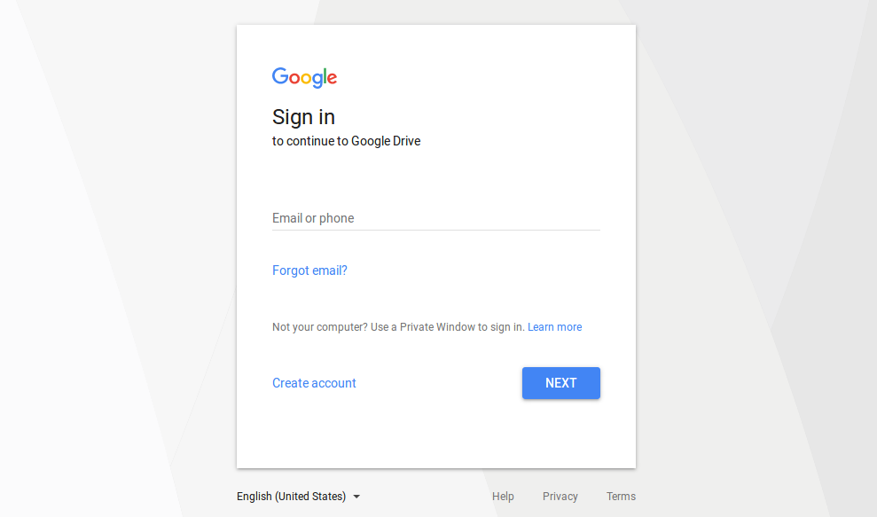</td>
</tr>
<tr>
    <td>
    <ul>
    <li>Cree un formulario seleccionando la opción de la izquierda que dice "En Blanco" con un gran "+" en el centro.</li>
    </ul>
    </td>
    <td>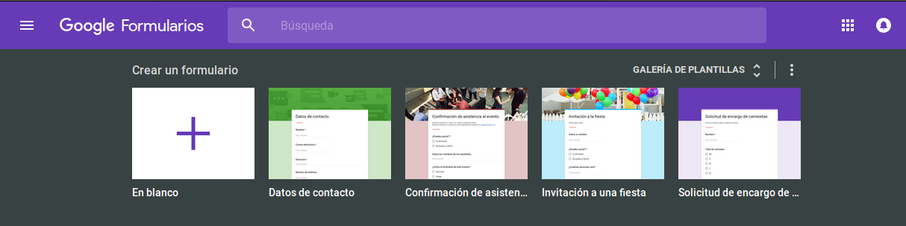</td>
</tr>
<tr>
    <td>
    <ul>
    <li>A continuación deberá ser redirigido a la siguiente pantalla.</li>
    <li>Para editar el nombre del archivo de la encuesta, debe hacer click sobre el texto de "Formulario sin título" de la esquina superior derecha. Esto cambiará también el título a mostrar a los participantes. Sin embargo si desea mostrar un nombre diferente, puede editarlo haciendo click sobre el título de la encuesta en negrita en el centro de la pantalla</li>
    <li>Debajo de este título, existe un campo para una descripción del formulario donde podrá insertar un encabezado o descripción de la misma. El motivo de la encuesta, los objetivos o cualquier detalle que sea de interés al colaborador o participante.</li>
    </ul>
    </td>
    <td>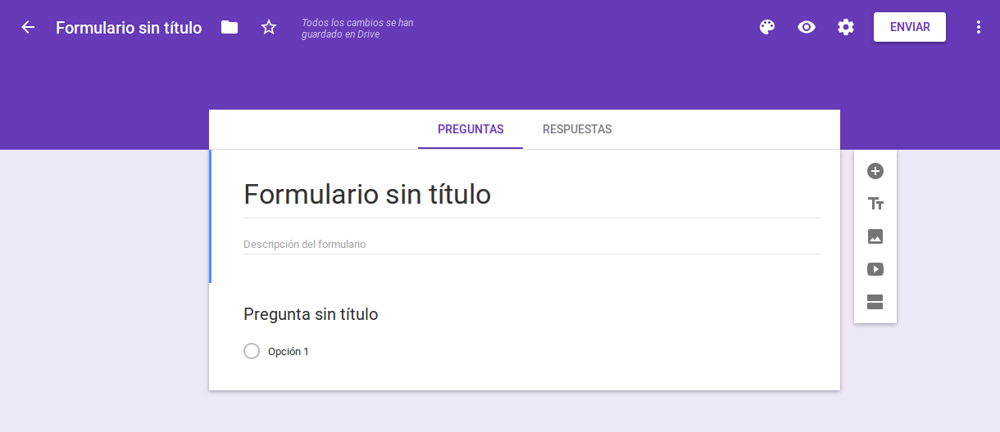</td>
</tr>
<tr>
    <td>
    <ul>
    <li>Este es el resultado de definir el nombre del archivo con un código de ejemplo de la encuesta y un título amistoso al participante.</li>
    </ul>
    </td>
    <td>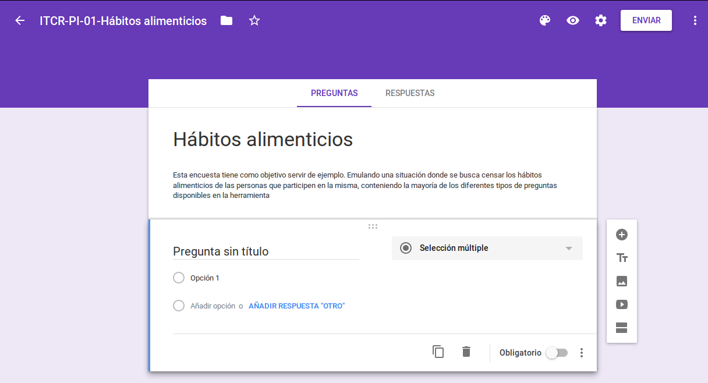</td>
</tr>
</table>

### Agregar una pregunta de respuesta breve

Este proceso se repetirá tantas veces en la encuesta como preguntas existan. Según nuestro caso de ejemplo, lo haremos 5 veces. En resumen, se debe agregar el enunciado de la pregunta, seleccionar el tipo de pregunta y agregar sus respuestas según aplique. A continuación el proceso:

<table>
<tr>
    <td width="30%">
    <ul>
    <li>Retomando en la pantalla anterior, note la "Pregunta sin título" que aparece por defecto. Haga click y cambie este título por el enunciado de la pregunta</li> 
    <li>Al hacer esto, se despliega al lado derecho un cuadro para seleccionar el tipo de pregunta. Proceda a seleccionar "Respuesta breve".</li>
    <li>Una pregunta de respuesta breve no tiene opciones ya que es abierta. Por lo tanto habremos terminado con esta pregunta</li>
    </ul>
    </td>
    <td width="70%">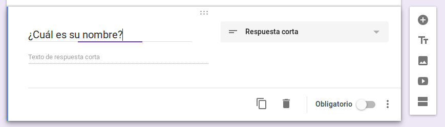</td>
</tr>
</table>

### Agregar una pregunta de verdadero o falso

Siguiendo la linea del procedimiento anterior:

<table>
<tr>
    <td width="30%">
    <ul>
    <li>Retomando en la pantalla anterior, note que a la derecha de la pregunta aparece un botón con un "+". Haga click sobre él para agregar una nueva pregunta.</li> 
    <li>Al hacer esto, se despliega Un nuevo espacio para agregar una pregunta. Escriba el título de la segunda pregunta y seleccione el tipo "Selección múltiple".</li>
    </ul>
    </td>
    <td width="70%">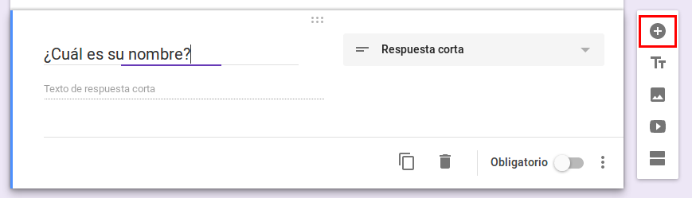</td>
</tr>
<tr>
    <td width="30%">
    <ul>
    <li>Haga click en el título de "Opción 1" para agregar "Si"</li> 
    <li>Luego haga click sobre "Añadir opción" para agregar "No"</li>
    </ul>
    </td>
    <td width="70%">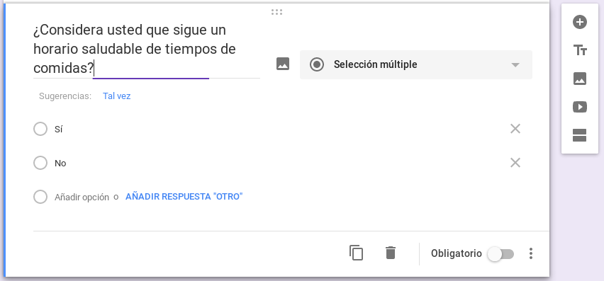</td>
</tr>
</table>

### Agregar una pregunta de selección múltiple

Siguiendo la linea del procedimiento anterior:

<table>
<tr>
    <td width="30%">
    <ul>
    <li>Agregue una nueva pregunta.</li> 
    <li>Escriba el título de la tercera pregunta y seleccione el tipo "Casillas de verificación".</li>
    </ul>
    </td>
    <td width="70%">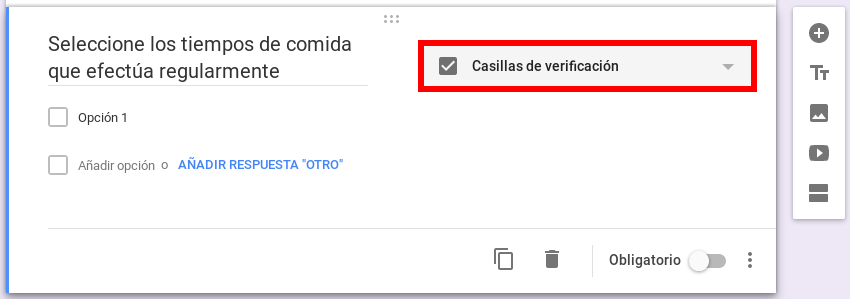</td>
</tr>
<tr>
    <td width="30%">
    <ul>
    <li>Agregue cada una de las opciones disponibles en la encuesta. En este caso escribiremos 5 tiempos de comidas.</li>
    </ul>
    </td>
    <td width="70%">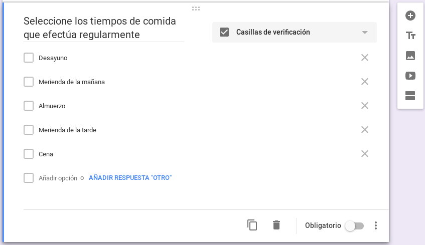</td>
</tr>
</table>

### Agregar una pregunta con rangos de respuesta

Siguiendo la linea del procedimiento anterior:

<table>
<tr>
    <td width="30%">
    <ul>
    <li>Agregue una nueva pregunta.</li> 
    <li>Escriba el título de la quinta pregunta y seleccione el tipo "Selección múltiple".</li>
    <li>Note cómo a pesar de tener un enfoque de rangos, la pregunta se puede escribir como de selección única.</li>
    </ul>
    </td>
    <td width="70%">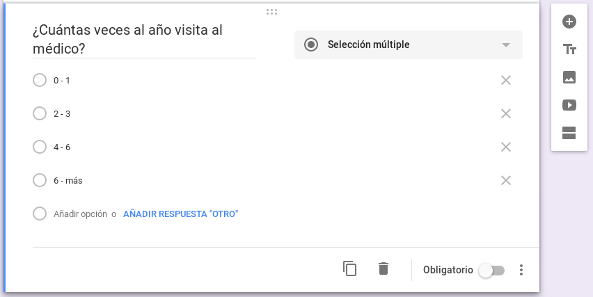</td>
</tr>
</table>

### Compartir la encuesta

Para compartir la encuesta con colaboradores o participantes directamente, debemos obtener el enlace (link) de la encuesta o ingresar el correo electrónico de la persona.

<table>
<tr>
    <td width="30%">
    <ul>
    <li>En la parte superior derecha de la página, seleccione el botón blanco que dice "Enviar".</li> 
    </ul>
    </td>
    <td width="70%">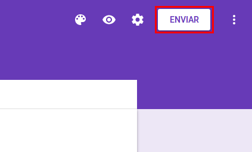</td>
</tr>
<tr>
    <td width="30%">
    <ul>
    <li>Si queremos enviarlo por invitación al correo electrónico, solo debemos llenar el formulario que se despliega en pantalla y escribir el correo de cada participante.</li> 
    </ul>
    </td>
    <td width="70%">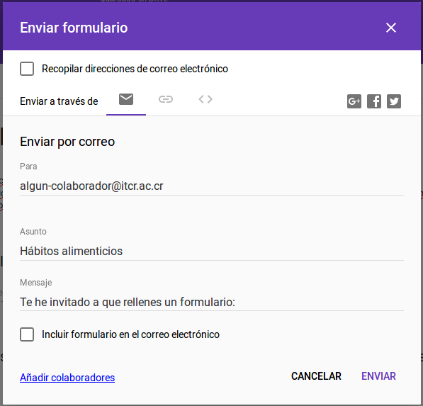</td>
</tr>
<tr>
    <td width="30%">
    <ul>
    <li>Si queremos compartir un enlace por un enlace común como un correo institucional con varios destinatarios o un grupo de whatsapp, haremos click sobre el botón que parece un clip acostado</li>
    <li>Luego haga click sobre "COPIAR" en la esquina inferior derecha de la ventana</li>
    <li>Si gusta, por comodidad puede acortar el enlace marcando la caja de "Acortar URL". Esto creará un nuevo enlace más corto pero siempre hacia la misma encuesta.</li>
    </ul>
    </td>
    <td width="70%">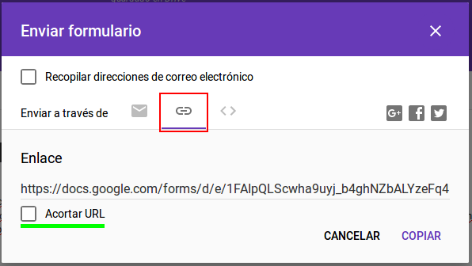</td>
</tr>
</table>
